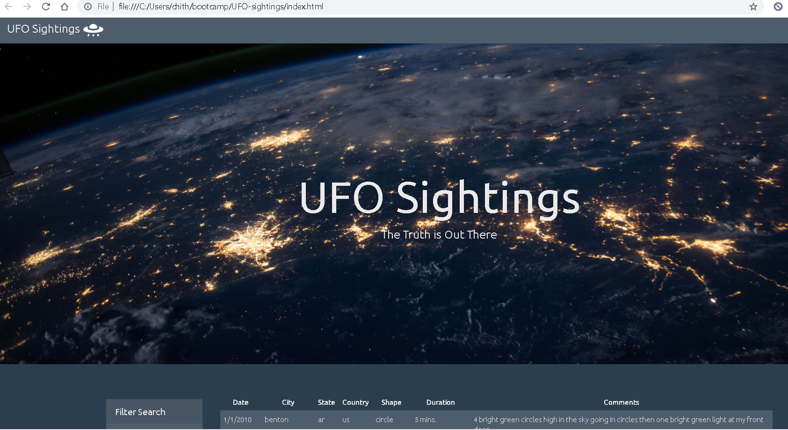
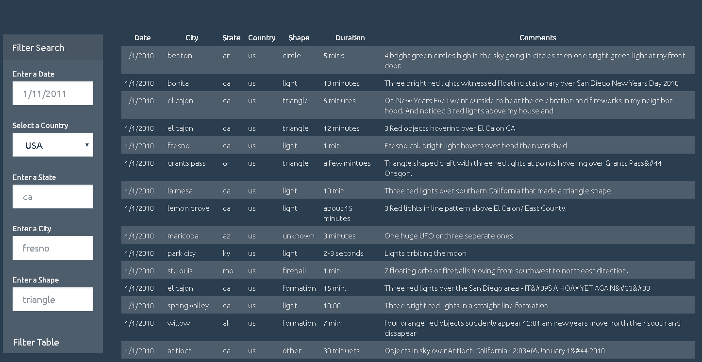
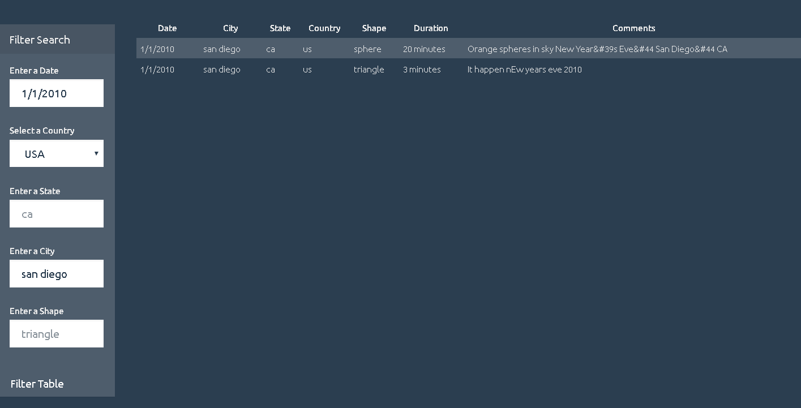

# UFO-sightings

Created a basic HTML web page using  JavaScript, HTML, CSS and D3.js

The UFO dataset is provided in the form of an array of JavaScript objects. The code appends a table to the web page and then adds new rows of data for each UFO sighting.

You can filter the UFO sightings  based on date/time, city, state, country and shape.

